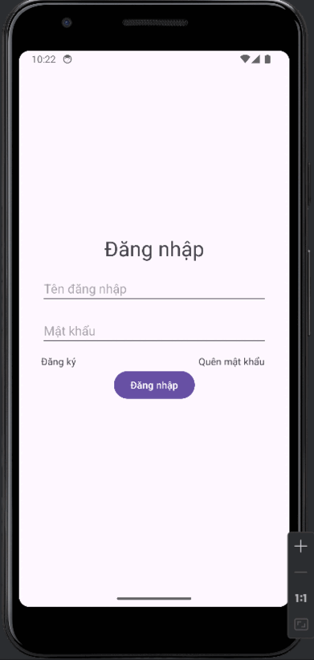

# QuanLyChiTieuNhom
QuanLyChiTieuNhom is an Android application developed in Java for managing group expenses. [Backend for this project](https://github.com/DinhHoangPhuc/QuanLyChiTieuNhom_backend).\
.

## Features

- User authentication and session management using tokens and refresh tokens.
- SharedPreferences for storing and retrieving user session information.
- Seamless and intuitive user interface using Android's Fragment and Navigation components.
- Data visualization using MPAndroidChart.
- Network requests handled by Volley and ZXing for barcode scanning.
- LiveData and ViewModel from Android Architecture Components for managing UI-related data.
- REST API calls and network operations handled by Retrofit and OkHttp.
- Efficient image loading and caching using Glide.

## Installation

Clone this repository and import into **Android Studio Jellyfish | 2023.3.1 Patch 1**
```bash
git clone https://github.com/DinhHoangPhuc/QuanLyChiTieuNhom.git
```
